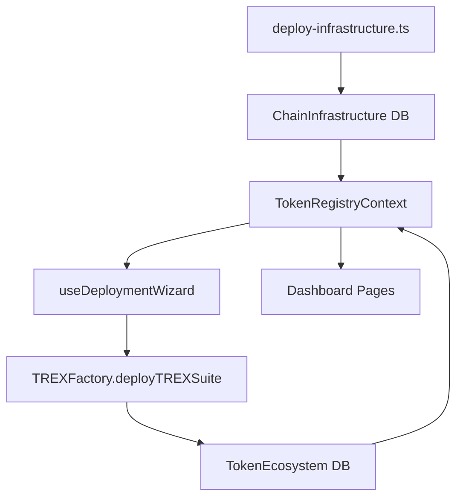
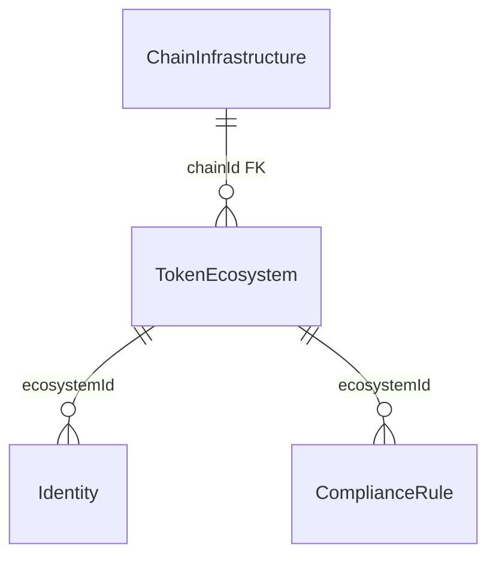

# System Patterns

## Architecture Overview

## Two-Layer Deployment Architecture

### Layer 1: Chain Infrastructure (once per chain)

Deployed by `smart-contracts/scripts/deploy-infrastructure.ts`. Stored in `chain_infrastructure` DB table and `frontend/config/deployed-addresses.*.json`.

| Contract                     | Purpose                               |
| ---------------------------- | ------------------------------------- |
| Token impl                   | Reused by all TokenProxy instances    |
| IdentityRegistry impl        | Reused by all IR proxies              |
| IdentityRegistryStorage impl | Reused by all IRS proxies             |
| TrustedIssuersRegistry impl  | Reused by all TIR proxies             |
| ClaimTopicsRegistry impl     | Reused by all CTR proxies             |
| ModularCompliance impl       | Reused by all MC proxies              |
| OID Identity impl            | Reused by all OnchainID proxies       |
| OID ImplementationAuthority  | Points to OID Identity impl           |
| OID IdFactory                | Creates per-wallet and per-token OIDs |
| TREXImplementationAuthority  | Points to all 6 TREX impl contracts   |
| TREXFactory                  | Deploys full token suites via CREATE2 |
| CountryRestrictModule        | Shared stateless compliance module    |
| CountryAllowModule           | Shared stateless compliance module    |
| MaxBalanceModule             | Shared stateless compliance module    |
| SupplyLimitModule            | Shared stateless compliance module    |

### Layer 2: Token Instance (per token via factory)

Deployed by `TREXFactory.deployTREXSuite()` in a single transaction. All 6 proxy contracts deployed via CREATE2 using a salt string.

| Contract                     | Purpose                                             |
| ---------------------------- | --------------------------------------------------- |
| TokenProxy                   | The ERC-3643 token (proxies to Token impl)          |
| IdentityRegistryProxy        | Token's identity registry                           |
| IdentityRegistryStorageProxy | Persistent identity storage                         |
| TrustedIssuersRegistryProxy  | Which claim issuers are trusted                     |
| ClaimTopicsRegistryProxy     | Which claim topics are required                     |
| ModularComplianceProxy       | Compliance rule enforcement                         |
| Token OnchainID              | Token's IERC734/IERC735 identity (via OIDIdFactory) |
| ClaimIssuer                  | Signs KYC/AML claims for investors                  |

## Database Schema

### `chain_infrastructure` table

- Primary key: `id` (UUID)
- Unique: `chainId` (INT) — one row per EVM chain
- All 15 shared contract addresses as flat `TEXT` columns
- `deployedBy`, `deployedAt` for audit trail

### `token_ecosystem` table

- Primary key: `id` (UUID)
- FK: `chainId` → `chain_infrastructure.chainId`
- All 8 per-token addresses as flat `TEXT` columns
- `salt` (CREATE2 salt used in deployTREXSuite)
- Unique: `(chainId, symbol, deployerAddress)` + `(chainId, salt)`

## Key Design Patterns

### Static Config Fallback

`TokenRegistryContext` fetches infrastructure from DB first. If DB returns 404 (infra not yet registered), it falls back to the bundled static JSON config (`frontend/config/deployed-addresses.*.json`). This ensures local Hardhat development works without a DB.

### Factory Pattern

`TREXFactory.deployTREXSuite(salt, tokenDetails, claimDetails)` deploys all 6 proxy contracts atomically. The `TREXSuiteDeployed` event encodes all 6 addresses — parsed from the receipt log.

### Resumable Deployment (WIP State)

`useDeploymentWizard` persists a `DeployWIPState` to localStorage after every completed step. On page refresh, the wizard reads the saved state and resumes from where it left off.

### Address Resolution

`ecosystemToContractAddresses(ecosystem, infrastructure)` in `frontend/contracts/config.ts` is the single source of truth for converting DB rows into the flat `ContractAddresses` shape used by all hooks.

## API Patterns

All API routes follow the same pattern modeled on `frontend/pages/api/compliance/index.ts`:

- GET with query params for filtering
- POST for upsert (idempotent by primary key or unique constraint)
- Prisma `upsert` for idempotency
- All error responses: `{ error: string }`

### Relevant routes

- `GET/POST /api/infrastructure?chainId=<n>` — chain infrastructure
- `GET/POST /api/ecosystems?chainId=<n>` — token ecosystems
- `GET/PUT/DELETE /api/ecosystems/:id` — single ecosystem
- `GET/POST /api/ecosystems/:id/identities` — investor identities
- `GET/POST /api/compliance?ecosystemId=<id>` — compliance rules
